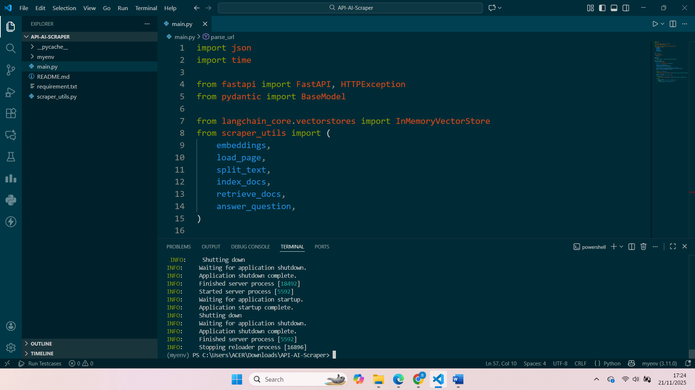

# AI Web Scraper API


## 📖 Overview

AI Web Scraper API is designed to extract structured JSON data from websites.

This project leverages **Llama 3.2** for both generation and embedding tasks, prioritizing low-latency inference and high-efficiency deployment.

## 🧠 Model Architecture & Selection

### Why Llama 3.2?
I selected **Llama 3.2** as the core engine for this application. The decision was driven by the following factors:

1.  **Efficiency-to-Performance Ratio:** Llama 3.2 offers SOTA reasoning capabilities in the [1B/3B] parameter class, allowing for significantly faster token generation and lower VRAM usage compared to larger models like Llama 3 70B.
2.  **Edge/Cloud Optimization:** The architecture is optimized for efficient hosting on consumer-grade hardware or cost-effective cloud instances (e.g., T4 GPUs or high-end CPUs).
3.  **Embedding Compatibility:** Using Llama 3.2 for semantic embeddings ensures alignment between the retrieval vector space and the generation model, reducing semantic mismatch in RAG pipelines.

### System Architecture
The system follows a modular pipeline:
1.  **Input Processing:** Request validation via Pydantic.
2.  **Embedding Layer:** Input text is vectorized using Llama 3.2.
3.  **Inference Engine:** The core Llama 3.2 model processes the context and generates the response.
4.  **API Layer:** Served via FastAPI for request handling.

---

## ⚡ Performance & Limitations

### Performance Optimizations
* **Adaptive Extraction:** Uses LLM to intelligently parse data, making it resilient to HTML layout changes.
* **Cost-Efficient:** Runs entirely locally using Ollama, eliminating external API costs.
* **Async Architecture:** Built on FastAPI to handle concurrent requests efficiently.

### Limitations
* **Inference Latency:** Slower than traditional scrapers due to Generative AI processing time.
* **Visible Content Only:** Cannot access data hidden via CSS or non-rendered DOM elements.
* **Context Window:** Extremely large web pages may be truncated to fit the model's token limit.

---

## 🛠️ Setup Instructions

Follow these steps to get the API running locally.

### Prerequisites
* Python 3.10 or higher
* Ollama installed
* Llama 3.2 Model pulled locally

### 1. Clone the Repository
```bash
git clone https://github.com/berlyand25/API-AI-Scraper.git
cd API-AI-Scraper
```
### 2. Create a Virtual Environment
```bash
python -m venv venv
# On Windows
venv\Scripts\activate
# On macOS/Linux
source venv/bin/activate
```

### 3. Install Dependencies
```bash
pip install -r requirements.txt
```

### 4. Run the Application
```bash
uvicorn main:app --reload
```

## 📡 API Documentation

The API is built using **FastAPI**. You can access the interactive Swagger documentation at `http://127.0.0.1:8000/docs` when the server is running.

### 1. Health Check
**GET** `/`

Verifies that the API server is running and ready to accept requests.

**Response:**
```json
{
  "message": "Welcome to the AI Web Scraper API!"
}
```

### 2. AI Web Scraper
POST /parse

This is the main endpoint. It accepts a URL and a natural language query, performs RAG (Retrieval-Augmented Generation) on the page content, and attempts to extract structured JSON data.

**Request Body:**

* url (string) : The target website URL to be scraped.
* query (string) : What you want to extract.

**Example Request:**
```json
{
  "url": "https://books.toscrape.com/",
  "query": "Can you return me the books: name and price?"
}
```

**Success Response (200 OK)**

Returns the extracted data along with execution metadata.

```json
{
  "result": [
    {
      "name": "Book 1",
      "price": "$19.99"
    },
    {
      "name": "Book 2",
      "price": "$29.99"
    }
  ],
  "message": "Found 2 record(s)",
  "metadata": {
    "processing_time_ms": 4502
  }
}
```

**Error Response**
* **404 Not Found** : **No Data Found**: The LLM could not find any relevant information matching your query in the provided URL context.
* **422 Unprocessable Entity** : **Validation Error**: The request body is missing required fields (url or query) or has the wrong data type.
* **500 Internal Server Error** : **Parsing Failed**: The LLM generated a response, but it was not valid JSON. This usually happens if the model hallucinates or includes conversational text outside the JSON block.

## 🎥 Demo
[](https://drive.google.com/file/d/1xJf9YGKTjJs6Bx593eDgWxAJJemvAcSR/view?usp=sharing)

## 🤝 Contributing
Contributions are welcome! Please fork the repository and submit a pull request.
